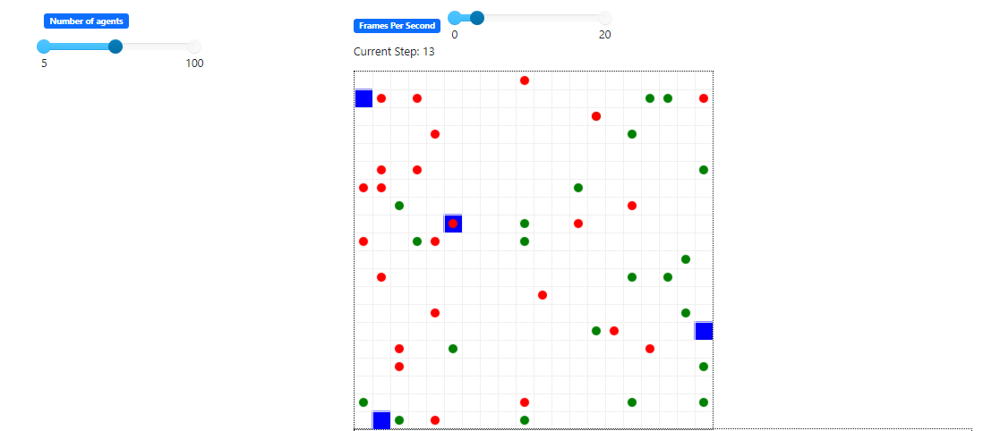
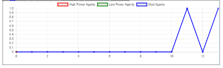

# Multi Agent Simulation

Game Mode is the game design using multi agent simulation theory.    

# Info

In this development we used python as the programming Language to develop the Game Mode. [Mesa](https://mesa.readthedocs.io/en/latest/) Library has been used for the multi agent simulation section.  

Game Mode defult port will be `8521`

Randomly create Agent Steps and move then also according to Random. 
If the Agent comes to the same location below condition will be perform 
- Power Up agent get 1 point and Power Low agent lose 1 point.
- Same Power Agent lose 1 point each.
- If the Power = 0 Agent will die. 

 

Death Agent Graph will be Shown below the battlefield
  

  
In the Game there are two parameters users can control
- Frame Rate

- Agent Number (After Changing the agent number need to click reset button to update)

# Packages

- [Mesa](https://pypi.org/project/Mesa/) : It allows users to quickly create agent-based models using built-in core components (such as spatial grids and agent schedulers) or customized implementations; visualize them using a browser-based interface; and analyze their results using Python’s data analysis tools. Its goal is to be the Python 3-based alternative to NetLogo, Repast, or MASON.

## Install

`pip install {Package}`

## License

- Apache License 2.0
